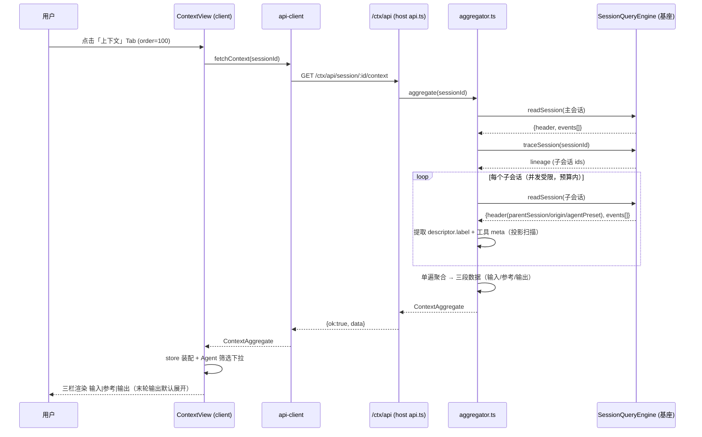
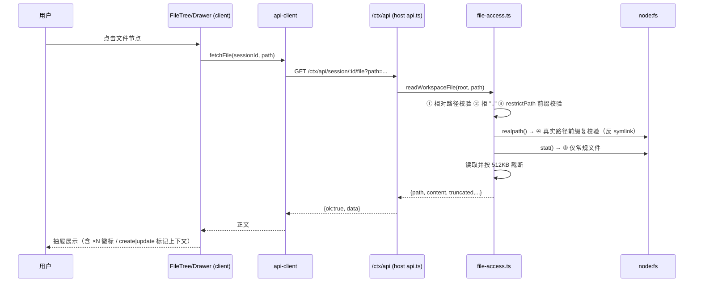

# dsh-coach 插件系统设计文档

> 版本：v1.0（2026-08-29）
> 作者：高见远（架构师）
> 状态：设计定稿，待工程实现
> 硬性约束：**全部基于基座能力实现，禁止依赖 `dsh-workbench-plugin` 的任何代码/事件/API；不改基座一行代码。**

---

## 0. 结论速览

- 双面插件（host + client），零新增外部依赖，host 面消费基座 `SessionQueryEngine` 即时聚合，不落盘、无状态。
- client 面按 `ui-trajectory` 的成熟惯例注册 `conversation.view` Tab（id=`context`，order=100，最右）。
- 布局方案 A：三栏同屏 输入|参考|输出（1 : 1.2 : 1），窄屏降级为单栏切换。
- `/ctx/api` 单前缀端点 + host 内手工分发；文件正文读取走五级安全校验链。
- 多 Agent 聚合：`traceSession` 取子会话谱系，`subagent/descriptor.label` 作徽标名，缺省回落 `agentPreset` → 会话 id 短码。
- **调研修正一处**：`write` 工具新建文件时 `meta.diffs === []`（见 `packages/fs/tool-fs/src/write.ts:95-100`，`before === null` 时 diffs 直接为空），新建文件路径必须从 `tool/call.arguments` 兜底解析。

---

## 1. 实现方案与框架选型

### 1.1 技术栈

| 维度 | 选型 | 理由 |
|---|---|---|
| 语言 | TypeScript（ESM，Node ≥ 22） | 与 monorepo 一致 |
| host 面 | 纯 TS，无框架 | 只做事件聚合 + HTTP 只读端点 |
| client 面 | React 函数组件 | 基座 client 面统一 React |
| 样式 | CSS Modules（`*.module.css`） | 与基座 client 包惯例一致，无运行时样式依赖 |
| 构建 | tsdown（bundle）+ tsc（types） | 与 dsh-workbench-plugin 构建脚本惯例相同，但仅作惯例参考 |
| 测试 | vitest | monorepo 统一 |

### 1.2 host / client 职责划分

```
┌───────────────────────────── 基座（不改一行） ─────────────────────────────┐
│  SessionQueryEngine (ctx.sessionQuery)          webServer (prefix 路由)   │
│  readSession / filterEvents /                                          │
│  traceSession / filterSessions                                         │
└──────────────▲──────────────────────────────────────▲───────────────────┘
               │ 服务调用                              │ ctx.webServer.register
┌──────────────┴──────────────── dsh-coach host ─────┴───────────────────┐
│  aggregator.ts   事件流 → 三段聚合（ContextAggregate）                    │
│  file-access.ts  文件正文读取 + 五级安全校验链                            │
│  api.ts          GET /ctx/api 前缀端点，内部手工分发 3 条路由             │
└──────────────▲──────────────────────────────────────▲───────────────────┘
               │ HTTP JSON                            │ HTTP JSON
┌──────────────┴──────────────── dsh-coach client ───┴───────────────────┐
│  api-client.ts   fetch 封装 + 载荷解包                                    │
│  ContextView.tsx Tab 根：三栏布局 + Agent 筛选 + 抽屉容器                 │
│  InputPane / RefPane / OutputPane + FileTree / Drawer / AgentBadge       │
└──────────────────────────────────────────────────────────────────────────┘
```

- **host 面**：唯一数据权威。所有聚合逻辑（输入分类、注入路径提取、参考计数、输出文件树、Agent 归属）都在 host 完成，client 只做展示与筛选，保证 client 可保持薄且可替换。
- **client 面**：通过 `ctx.slots.inject('conversation.view', ...)` 注册 Tab；组件激活时经 `api-client` 拉取 `/ctx/api`，本地 store 只存视图态（选中 Agent、抽屉目标、展开/折叠），不缓存聚合数据权威副本（每次 Tab 激活重新拉取，依赖 HTTP 层的即时聚合语义）。

### 1.3 关键设计决策

1. **即时聚合，不落盘**：每次 Tab 激活或手动刷新时全量聚合一次。会话日志是 append-only，聚合是 O(n) 单遍扫描 + 投影，成本可接受（见 §7.5 性能预算）。
2. **多 Agent 聚合策略**：主会话 `readSession` 全量扫；子会话经 `traceSession` 取谱系后逐个 `readSession`，但只提取 `subagent/descriptor`（label）与工具 meta（计数/文件输出），单子会话扫描设预算上限（§7.5），超限子会话降级为「仅徽标，无明细」。
3. **父→子回链以会话头为准**：子会话 header 自带 `parentSession / origin:'subagent' / delegationDepth / agentPreset`（`packages/core/session/src/types.ts:75-98`），这是聚合的可靠锚点；父会话的 `subagent/start` 事件（`SubagentRunInfo.runId + id`，`packages/subagent/subagent/src/types.ts:38-46`）仅用于展示运行配对信息，不作聚合依赖（回链缺失时徽标仍可渲染）。
4. **write 新建文件兜底**：`write` 工具 `meta.diffs` 在新建时为空数组，聚合器对 `write` 一律从 `tool/call.arguments` JSON 解析 `file_path` 作为路径源；`create/update` 判定：diffs 非空 → update；diffs 为空 → create（write 语义上 before=null 即新建）。
5. **状态与刷新**：client 激活时拉取一次；提供手动刷新按钮。不订阅基座事件流（避免引入实时订阅依赖，保持只读、无状态），后续可在「待明确事项」里评估增量轮询。

---

## 2. 文件清单（dsh-coach/ 下完整列表）

```
dsh-coach/
├── package.json                  # 双面插件清单：name/exports("./"与"./client")/dsh.bundle.patch/dsh.client.inject
├── cordis.patch.yml              # bundle 层补丁：声明插件行（id: dsh-coach, name: dsh-coach）
├── tsconfig.json                 # TS 编译配置（host + client 双入口）
├── README.md                     # 插件说明（安装、能力边界）
├── src/
│   ├── shared/                   # host/client 共用纯逻辑（无 IO、无框架依赖）
│   │   ├── types.ts              # 三段聚合数据接口 + /ctx/api 请求/响应契约类型（§3 全部接口的唯一权威定义处）
│   │   ├── constants.ts          # 载荷预算常量：单条文本截断 4KB、文件正文 512KB、子会话扫描上限等
│   │   ├── path.ts               # 路径规范化（normalizeWorkspacePath）+ 安全校验纯函数（isSafeRelativePath）
│   │   └── extract.ts            # 注入消息文件路径提取纯函数（extractInjectFilePaths，规则见 §3.5）
│   ├── host/
│   │   ├── aggregator.ts         # 核心聚合器：SessionQueryEngine 事件流 → ContextAggregate（输入分类/参考计数/输出树/Agent 归属）
│   │   ├── file-access.ts        # 文件正文读取：五级安全校验链 + 512KB 截断（§3.7 file 端点）
│   │   ├── api.ts                # GET /ctx/api 前缀端点：手工分发 context/file/output-text 三条路由 + 统一错误包络
│   │   └── index.ts              # host 插件入口：注册服务与 ctx.webServer.register({kind:'prefix', path:'/ctx/api'})
│   └── client/
│       ├── index.tsx             # client 入口：ctx.slots.inject('conversation.view', ...) 注册 Tab（id:'context', order:100）
│       ├── api-client.ts         # fetch('/ctx/api/...') 封装：类型化解包、错误归一、中止信号
│       ├── store.ts              # 视图状态 store：选中 agentKey、抽屉目标、注入区展开态、加载/错误态
│       ├── ContextView.tsx       # Tab 根组件：三栏布局（1:1.2:1，窄屏单栏切换）+ Agent 筛选下拉 + 刷新
│       ├── panes/
│       │   ├── InputPane.tsx     # 输入栏：用户输入时间线卡片 + 系统注入折叠区 + 注入文件树
│       │   ├── RefPane.tsx       # 参考栏：目录树 + ×N 查看徽标 + Agent 徽标
│       │   └── OutputPane.tsx    # 输出栏：文字输出卡片（末轮默认展开）+ 输出文件树（create/update 标记）
│       ├── components/
│       │   ├── FileTree.tsx      # 通用目录树组件（参考树/输出树/注入树复用，支持徽标插槽与排序）
│       │   ├── Drawer.tsx        # 右侧抽屉：文件正文（file 端点）或条目全文渲染
│       │   └── AgentBadge.tsx    # Agent 徽标（主Agent / 子Agent label 短码）
│       └── locales/
│           ├── zh-CN.ts          # 中文文案（Tab label、栏标题、徽标、空态、错误）
│           └── en-US.ts          # 英文文案
└── tests/
    ├── path.spec.ts              # path.ts 纯函数 + file-access 五级安全校验链（../、绝对路径、symlink 逃逸、目录、截断）
    ├── extract.spec.ts           # 注入路径提取规则与兜底策略用例
    ├── aggregator.spec.ts        # 聚合器：输入分类、部分读计数口径、write 兜底、Agent 归属、预算降级
    └── api.host.spec.ts          # /ctx/api 三端点集成：契约形状、错误码、安全链端到端
```

> 说明：`src/shared/*` 同时被 host 与 client 引用，保证契约类型单源；不复制 dsh-workbench-plugin 任何代码。

---

## 3. 数据结构与接口

### 3.1 顶层聚合结果 `ContextAggregate`

```ts
/** 三段聚合的顶层载荷（GET /ctx/api/session/:id/context 的 data） */
interface ContextAggregate {
  sessionId: string
  generatedAt: number            // 聚合时间戳（epoch ms）
  agents: AgentBadge[]           // 参与聚合的全部 Agent（含主），供筛选下拉与徽标渲染
  inputs: InputsSection
  references: ReferencesSection
  outputs: OutputsSection
  budgets: PayloadBudgets        // 各段是否触发截断/降级的标记，client 据此提示
}

interface AgentBadge {
  agentKey: string               // 聚合内稳定键：'main' | 子会话 sessionId
  sessionId: string
  label: string                  // descriptor.label ?? agentPreset ?? sessionId 前 8 位短码
  role: 'main' | 'subagent'
  delegationDepth?: number
  degraded?: boolean             // true = 该子会话超出扫描预算，仅提供徽标无明细
}

interface PayloadBudgets {
  inputsTruncated: boolean       // 输入条目数或单条文本超限被截断
  referencesTruncated: boolean   // 参考文件条目超上限被截断
  outputsTruncated: boolean      // 输出条目超上限被截断
  childrenScanned: number        // 实际扫描的子会话数
  childrenTotal: number          // 谱系中的子会话总数
}
```

### 3.2 输入段 `InputsSection`

```ts
interface InputsSection {
  userItems: UserInputItem[]       // 用户主动输入时间线（source.kind === 'user'）
  pluginItems: PluginInjectItem[]  // 系统注入折叠区（source.kind === 'plugin'）
  injectTree: FileTreeNode[]       // 从 pluginItems 提取路径构建的文件树（§3.5）
}

interface UserInputItem {
  seq: number
  time: number
  turn?: number
  agentKey: string
  text: string                     // 拼接后的纯文本（ContentBlock 中 text 块）
  textTruncated: boolean
  attachments: AttachmentRef[]     // 提示词附带的附件
}

interface AttachmentRef {
  name: string                     // 展示名
  path?: string                    // 可解析的工作区相对路径（可点击进抽屉）
  mediaType?: string
}

interface PluginInjectItem {
  seq: number
  time: number
  agentKey: string
  plugin: string                   // source.plugin
  form?: 'instructions' | 'catalog' | 'snapshot' | 'notice' | 'relay' | 'recall'  // ContextForm
  summary?: string                 // form='notice' 的一行摘要
  text: string                     // 正文（折叠区展开/抽屉用，单条截断 4KB）
  textTruncated: boolean
  filePaths: string[]              // extractInjectFilePaths 的提取结果（已规范化）
}
```

### 3.3 参考段 `ReferencesSection`

```ts
interface ReferencesSection {
  tree: FileTreeNode[]             // 目录树（含 viewCount / agents 徽标数据）
  totalFiles: number
  totalViews: number               // 全部查看次数合计
}

/** 目录树节点（参考树 / 输出树 / 注入树三处复用） */
interface FileTreeNode {
  name: string                     // 末级名称（目录名或文件名）
  path: string                     // 规范化工作区相对路径（目录节点为目录路径，无尾斜杠）
  type: 'file' | 'dir'
  children?: FileTreeNode[]        // 仅 dir；同层按 dir 前、字典序排序
  // —— 参考树专用徽标字段 ——
  viewCount?: number               // 累计查看次数（read / read_image / str_replace_editor view）
  // —— 输出树专用标记字段 ——
  outputOp?: 'create' | 'update'   // 输出文件的新建/更新标记
  // —— 共用 ——
  agents?: string[]                // 贡献该节点的 agentKey 列表（去重，主在前）
}
```

### 3.4 输出段 `OutputsSection`

```ts
interface OutputsSection {
  textSegments: OutputTextSegment[]  // 按时间升序；client 末轮默认展开、历史轮次折叠
  files: FileTreeNode[]              // 输出文件树（FileTreeNode.outputOp = create|update）
  totalFiles: number
}

interface OutputTextSegment {
  seq: number
  time: number
  turn: number
  step: number
  agentKey: string
  round: number                      // 轮次序号（turn/start 去重编号），client 用于「末轮默认展开」
  text: string                       // assistant/message 拼接文本（单段截断 4KB）
  textTruncated: boolean
  interrupted?: boolean              // 被中断的半截输出
}
```

### 3.5 注入文件路径提取规则（`extractInjectFilePaths`）

**输入**：`PluginInjectItem` 的 `form`、`summary`、`text`。**输出**：规范化相对路径数组（去重保序）。

提取规则（按序应用，命中即收）：

1. **结构化优先**：`form === 'snapshot'` 时逐 `sections[].text` 提取（每段独立提取后合并）。
2. **显式模式**：正则匹配「读取/Read/加载/文件：」等动词后紧跟的路径 token，以及 markdown 链接 `[x](path)`、行内代码 `` `path` `` 中的路径。
3. **通用路径模式**：含 `/` 的相对路径 token（`(^\.{0,2}/)?[\w.@-]+(/[\w.@-]+)+`），或命中**已知注入文档名集合**的无斜杠文件名：`AGENTS.md`、`CLAUDE.md`、`README.md`、`SKILL.md`。
4. **排除项**：`http(s)://` URL、以 `-` 开头的命令行 flag、纯数字/版本号、以 `..` 起始逃逸出工作区的路径、基座内部前缀（如 `node_modules/`、`.git/`）。
5. **规范化**：`normalizeWorkspacePath` —— 去 `./`、折叠多斜杠、保留语义 `..`（若解析后仍在工作区内）。
6. **兜底策略**：全文无任何候选路径时返回空数组，该注入条目仅留在折叠区，**不**出现在注入文件树；提取疑似但不合法的 token 不猜测补全（宁缺勿错）。

### 3.6 `/ctx/api` 端点契约

统一包络（所有端点）：

```jsonc
// 成功
{ "ok": true, "data": { ... } }
// 失败
{ "ok": false, "error": { "code": "CTX_FILE_FORBIDDEN", "message": "..." } }
```

错误码约定：`CTX_SESSION_NOT_FOUND` / `CTX_FILE_FORBIDDEN` / `CTX_FILE_NOT_FOUND` / `CTX_INDEX_OUT_OF_RANGE` / `CTX_BAD_REQUEST` / `CTX_INTERNAL`。HTTP 状态码同步映射（404/403/400/500），便于排障。

#### ① `GET /ctx/api/session/:id/context`

- 请求：无额外参数（预留 `?agent=<agentKey>` 查询位，v1 由 client 端过滤，host 不处理）。
- 响应 `data`：`ContextAggregate`（§3.1）。

#### ② `GET /ctx/api/session/:id/file?path=<workspace-relative-path>`

- 请求：`path` 必填，工作区相对路径（URL 编码）。
- 安全校验链（file-access.ts，逐级执行、任一不过即 `CTX_FILE_FORBIDDEN`）：
  1. 仅接受相对路径（拒绝绝对路径与盘符）；
  2. 拒绝含 `..` 段的路径（规范化后复查）；
  3. 以会话工作区根 `restrictPath` 限定（`path.resolve(root, path)` 后必须仍以 `root + sep` 为前缀）；
  4. `fs.realpath` 解析真实路径后再次前缀校验（反 symlink 逃逸）；
  5. `stat` 必须是常规文件（拒绝目录/设备）。
- 响应 `data`：

```jsonc
{
  "path": "src/index.ts",          // 规范化后的工作区相对路径
  "realPath": "/abs/root/src/index.ts",
  "size": 12345,
  "content": "...",                // UTF-8 文本
  "truncated": true,               // 超过 512KB 截断
  "encoding": "utf-8"
}
```

#### ③ `GET /ctx/api/session/:id/output-text?index=<n>`

- 请求：`index` 为 `outputs.textSegments` 数组下标（0 起）。
- 响应 `data`：`{ "index": 2, "agentKey": "main", "turn": 7, "text": "<完整正文，不截断>" }`；越界返回 `CTX_INDEX_OUT_OF_RANGE`。

### 3.7 参考计数口径（设计裁定）

- **计数源**：`tool/call`（`name ∈ {read, read_image, str_replace_editor}`）与其配对 `tool/result`（`callId` 配对）。
- **路径来源**：优先 `tool/result.meta.path`（read 工具携带，`packages/fs/tool-fs/src/read.ts:123-132`）；缺失时回落解析 `tool/call.arguments` 的 `file_path` 字段（JSON 解析失败则丢弃该条）。
- **str_replace_editor 仅计 `view` 命令**：从 arguments 解析 `command === 'view'` 才计数；`create/str_replace/insert` 归入输出段而非参考段。
- **部分读取口径**：`meta.offset/lines` 只表示读取窗口，**同一文件多次部分读每次仍 +1**（每次调用都是一次真实查看行为，与用户直觉一致）；聚合结果中该文件 `viewCount` 为调用次数，不按行数加权。
- **Agent 归属**：该次调用发生所在的会话（主或某子会话）即归属 Agent；多 Agent 共同读过的文件 `agents` 数组按首次出现排序。

---

## 4. 程序调用流程

### 4.1 主流程：Tab 激活 → 三栏渲染



### 4.2 文件查看流程：点击树节点 → 抽屉正文



---

## 5. 任务列表（实现顺序，含依赖）

| # | 任务 | 产出文件 | 依赖 | 说明 |
|---|---|---|---|---|
| 1 | 工程脚手架与契约 | `package.json`、`cordis.patch.yml`、`tsconfig.json`、`src/shared/types.ts`、`src/shared/constants.ts` | — | 清单双面结构对齐惯例；types 为全项目唯一契约源 |
| 2 | 共享纯逻辑 | `src/shared/path.ts`、`src/shared/extract.ts` + `tests/path.spec.ts`、`tests/extract.spec.ts` | 1 | 路径规范化、安全校验纯函数、注入路径提取；纯函数先行，单测同步落 |
| 3 | host 聚合器 | `src/host/aggregator.ts` + `tests/aggregator.spec.ts` | 1, 2 | 三段聚合核心；用测试夹具事件流驱动，覆盖 §3.7 计数口径与 write 兜底 |
| 4 | host 文件访问 + API | `src/host/file-access.ts`、`src/host/api.ts`、`src/host/index.ts` + `tests/api.host.spec.ts` | 3 | 五级安全链端到端用例必须含 symlink 逃逸用例 |
| 5 | client 骨架 | `src/client/index.tsx`、`src/client/api-client.ts`、`src/client/store.ts`、`src/client/locales/*` | 1 | Tab 注册（声明 `inject:['slots',...]`，包在 `ctx.slots.inject` 里，不传 priority）；locales 常量化 |
| 6 | client 三栏 UI | `src/client/ContextView.tsx`、`src/client/panes/*`、`src/client/components/*` | 5 | FileTree 先行（三处复用）；再 InputPane → RefPane → OutputPane → Drawer |
| 7 | 联调回归 | — | 4, 6 | 真实会话端到端：多 Agent、超大日志、symlink、空会话边界 |

> 任务 #2/#3/#4 对应总任务系统的「工程实现 host 面」；#5/#6 对应「工程实现 client 面」；#7 对应「测试验证」。

---

## 6. 依赖包列表

**零新增外部依赖。** 全部使用：

- 基座 workspace 内依赖（host 面）：
  - `@deepseek-ai/cordis`（Context/Service）
  - `@deepseek-ai/dsh-session`（SessionId、事件类型、snapshotSessionEvent）
  - `@deepseek-ai/dsh-session-query`（SessionQueryEngine 及类型）
  - `@deepseek-ai/dsh-llm`（Message / MessageSource / ContextForm 类型，仅类型引用）
- 基座 client 注入（client 面，`dsh.client.inject` 声明）：
  - `@deepseek-ai/dsh-client-locale`（文案）
  - `@deepseek-ai/dsh-client-ui-conversation`（conversation.view 契约类型）
  - 其余按 slot-catalog 对 conversation.view 条目的注意项最小化声明
- Node 内建：`node:fs/promises`、`node:path`、`node:url`。
- 开发依赖：`tsdown`、`typescript`、`vitest`（版本对齐 monorepo 根）。

---

## 7. 共享知识（跨文件约定）

### 7.1 路径规范化（`normalizeWorkspacePath`）

- 统一 POSIX 风格 `/` 分隔；去前导 `./`；折叠连续 `/`；空段剔除。
- `..` 段：解析后仍在工作区内的保留其规范化结果，逃逸出工作区的整条丢弃（不向上截断重写）。
- 树构建与去重一律用规范化后路径做 key；`meta.path` 原样值仅作展示备选。

### 7.2 Agent 归属字段命名

- 聚合内部统一 `agentKey`（`'main'` 或子会话 sessionId），**所有**条目级对象（UserInputItem / PluginInjectItem / OutputTextSegment / FileTreeNode.agents）都携带 `agentKey` 或 `agents`，命名不另起炉灶。
- 展示名一律走 `AgentBadge.label` 推导链：`descriptor.label` → `agentPreset` → sessionId 前 8 位短码；主会话固定「主Agent」（locale 化）。

### 7.3 错误处理约定

- host：端点内所有异常归一到 `{ok:false, error:{code,message}}`；未知异常收敛为 `CTX_INTERNAL` 且 message 脱敏（不带绝对路径与内部栈）。
- client：api-client 抛 `ContextApiError{code,message}`；UI 层对 `CTX_SESSION_NOT_FOUND` 显示空态、其余显示可重试错误条。
- 聚合器对**单条事件**的脏数据（JSON 解析失败、未知工具名）静默跳过并计数进 `budgets`（不中断整体聚合）；对**会话级**失败（子会话读取失败）降级为 `degraded: true`。

### 7.4 载荷预算约定（constants.ts 单源）

| 预算项 | 默认值 | 生效位置 |
|---|---|---|
| 单条文本（输入/输出段/注入正文） | 4 KB 截断 | aggregator |
| 文件正文 | 512 KB 截断 | file-access |
| 子会话扫描数 | ≤ 32 | aggregator（超出 degraded） |
| 单子会话扫描事件数 | ≤ 20 000 | aggregator（超出 degraded） |
| 参考文件条目 | ≤ 2 000 | aggregator |
| 输出文字段 | ≤ 500 | aggregator |

所有截断/降级都置位 `PayloadBudgets`，client 顶部展示「已截断」提示。

### 7.5 大事件流聚合性能

- 主路径用 `readSession`（一次载入 + `Session.create` 回放校验）做**单遍投影扫描**：`switch(event.type)` 只提取 user/message、tool/call（name+arguments）、tool/result（meta）、assistant/message、subagent/descriptor 五类，其余事件零成本跳过；不构建中间数组。
- `tool/call` 与 `tool/result` 经 `callId` 单趟 Map 配对，不回溯。
- 子会话并发读取用小并发池（默认 4），失败隔离（§7.3）。
- 不使用 `filterEvents` 做主聚合：其返回为语义检索文档而非完整原始事件，投影不全；`filterEvents` 仅在将来做全文检索类需求时启用。
- Tab 激活即触发一次聚合；连续切换 Tab 不重复拉取（client store 以 sessionId 缓存最近一次结果，带 `generatedAt` 供「手动刷新」比对）。

---

## 8. 待明确事项

1. **实时性**：v1 为「激活时快照」。会话进行中 Tab 数据是否需要自动刷新（如 10s 轮询或基座事件订阅）——建议 v1 手动刷新，v2 评估订阅 `ctx.sessions` 状态变化。
2. **会话工作区根的获取**：file 端点的 `root` 取自会话 header `cwd`（readSession 的 header）。若 header 缺 cwd（异常日志），file 端点整体拒绝并返回 `CTX_FILE_FORBIDDEN`——是否需要更友好的降级待确认。
3. **附件 AttachmentRef 的 path 解析**：`user/message` 的附件块结构中是否稳定携带工作区路径（vs 仅 blob 引用），实现时需以真实日志样本核对；若无路径则 v1 附件仅展示名。
4. **read_image 的 meta**：`read-image.ts` 未观察到 presentationMeta（grep 无命中），计数回落 `tool/call.arguments.file_path` 解析——实现时用真实样本确认是否有 meta.path 可用。
5. **`?agent=` 服务端过滤**：v1 client 端过滤；若子会话多、载荷大成为问题，v2 在 host 支持 `agentKey` 参数裁剪聚合范围。
6. **locale 机制细节**：Tab `label` 用 `() => t('...')` 形式还是 locale NS 声明，按 slot-catalog 对动态插件的注意项在实现任务 #5 时定稿。
