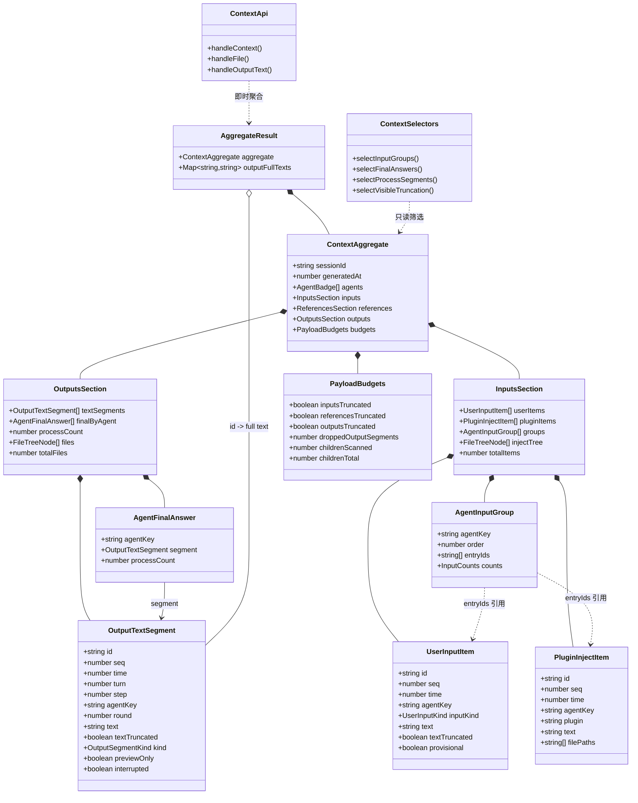
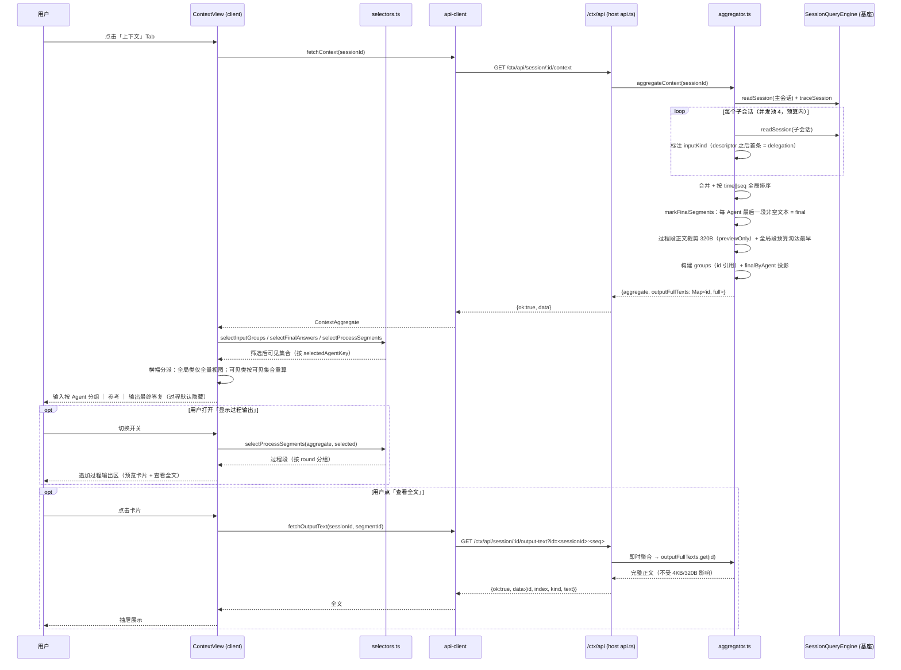

# dsh-coach 增量设计 v1.1（改版：最终产物 / 按 Agent 分组 / 委派归属）

> 版本：v1.1（2026-08-30）
> 作者：高见远（架构师）
> 基线：`dsh-coach` v1.0（commit 2201298，172 测试全绿）+ 设计文档 `dsh-coach-design.md` §3/§7
> 状态：设计定稿，待工程实现
> 硬约束不变：**全部基于基座能力，禁止依赖 `dsh-workbench-plugin` 的代码/事件/API；不改基座一行代码。**
> 本轮只出设计，不写实现代码。

---

## 0. 结论速览（决策一览）

| # | 议题 | 裁定 |
|---|---|---|
| 1 | 输出段数据结构 | **单一权威数组 `textSegments` + 段上 `kind` 标记** + `OutputsSection` 上派生投影 `finalByAgent`。不拆双数组 |
| 2 | 最终答复边界 | 每个 Agent **时间序最后一段非空文本**（空文本段无资格）；零非空文本的 Agent **不出现在文字区**，但仍在徽标列表与文件树 |
| 3 | `output-text` 端点 | **做 id 化**（`?id=<sessionId>:<seq>`），`?index=` 降级为 deprecated；`AggregateResult.outputFullTexts` 由「下标对齐数组」改为「id → 全文 Map」 |
| 4 | 响应兼容性 | **内部 BREAKING、外部无破坏**。host 与 client 同包同版本发布，`/ctx/api` 是插件私有端点，无跨版本兼容需求 |
| 5 | 载荷预算 | 过程段**保留但正文裁剪为 320B 预览**（新常量 `PROCESS_PREVIEW_BYTES`）。280 段实测载荷由 ~420KB 降至 ~104KB。**不引入按需拉取端点** |
| 6 | 段预算淘汰方向 | 由「超出不再计入（保留最早）」改为**滑动窗口保留最新**。理由：最终答复判定依赖最新段，保留最早会让决策 1 在超限日志上失效 |
| 7 | 委派指令归属 | 主路径 = 子会话自身首条（descriptor 之后的）`user/message`，归子 Agent；**父会话 `subagent` tool/call 兜底：做，但严格门控 + `provisional` 标记** |
| 8 | 截断横幅缺陷 | 横幅分两类：**全局类**（条目超限/参考超限/子会话降级）只在「全部 Agent」视图显示；**可见类**（单条正文被截断）由 client 基于筛选后可见集合重算 |
| 9 | 图标与抽屉主题对齐 | 图标 vendored 基座 `ic_ds_*` 子集（零运行时耦合、像素级同源）；抽屉配色改 `--dsw-alias-*` 令牌层，随外层 Light/Dark 联动、无需 JS |

---

## 1. 关键设计问题逐条裁定

### 1.1 数据结构变更：`kind` 标记 vs 双数组

**裁定：`kind` 标记 + 派生投影。**

理由：

1. **保护单一事实源**。拆成 `finalSegments` + `processSegments` 会让「同一段属于哪个数组」变成第二处需要维护的真相，且「最终答复」本身是**合并排序之后**才能判定的派生属性（§1.2），扫描期无法预知。
2. **保护下标空间与端点语义**。`output-text` 端点、既有 172 测试、`round` 重编号都依赖一个连续时间序数组。单数组 + `kind` 让这些全部零改动。
3. **符合既有架构分层**（设计文档 §1.2「所有聚合逻辑在 host 完成，client 只做展示与筛选」）。派生投影 `finalByAgent` 由 host 计算并下发，client 不需要自己跑「取每个 Agent 最后一段」的规则。

代价与对冲：client 需要按 `kind` 过滤（一次 `filter`），已由新增的 `src/client/selectors.ts` 统一封装（§4.3），不在组件里散落。

**对 `src/shared/types.ts`（契约单源）的影响**：纯 additive 为主 + 2 处字段语义窄化（§3.4 / §3.5）。详见 §3。

---

### 1.2 「某个 Agent 的最终答复」判定规则

判定发生在**合并 + 全局时间排序之后**（`aggregator.ts` 现有排序点 `aggregator.ts:636-642` 之后、`round` 重编号之后），因为「最后一段」是时间序概念。

#### 规则 F1 · 有资格的集合

候选段 = 该 Agent 的 `textSegments` 中 **文本内容非空白** 的段（`text.trim().length > 0`）。
纯工具调用产生的空 `assistant/message`（`extractMessageContent` 返回 `''`）**无资格**。

#### 规则 F2 · 最终答复 = 候选中时间序最后一段

`final = candidates[candidates.length - 1]`（数组已按 `time || seq` 升序）。

> **问：若其后又有工具调用和新的文本段怎么办？**
> 答：**定义自洽，无需特判。**「最后一段」是相对于**聚合快照时刻**而言。后续工具调用与新文本段会成为新的最后一段，下次聚合时它就是最终答复。这与「Tab 激活时快照」（设计文档 §1.3.1 / §7.5）的语义一致。

#### 规则 F3 · 被中断的段（`interrupted === true`）

**仍算最终答复**——它就是该 Agent 最后说出的话。保留 `interrupted` 标记，UI 显示「已中断」。

#### 规则 F4 · 零非空文本输出的 Agent

**不出现在输出栏文字区**（不凭空造答复）。但该 Agent：

- 仍出现在 `agents` 徽标列表与筛选下拉（它可能贡献了文件产出）；
- 若它有输出文件，仍可通过 `outputs.files` 的 `agents` 字段在文件树上看到它；
- 按该 Agent 筛选时，文字区渲染 `state.empty`；若该 Agent 同时无文件产出，追加一行 `output.noText` 说明。

#### 规则 F5 · 排序：主 Agent 最前，子 Agent 按现有徽标顺序

`finalByAgent` 的顺序 = `agents` 数组顺序（main 在前，子会话按 `traceSession` 谱系树序），**不是时间序**。这是用户决策 1 的明确要求。

#### 规则 F6 · 预算豁免与淘汰方向

- **最终答复段永不因段预算被丢弃。**
- 过程段超限时**丢弃最早的**（保留最新）：既保住 F2 的输入，也符合「上下文 Tab 的价值在最近发生了什么」。
- 单会话扫描期改为**滑动窗口**：`segments.length` 触达 `MAX_OUTPUT_SEGMENTS * 2` 水位时一次性 `slice(-MAX_OUTPUT_SEGMENTS)` 并置 `outputSegmentsCapped`（避免每次 `shift()` 的 O(n²)，内存上界 ≈ 1000 段 ≈ 4MB）。
- 合并排序后新增全局上限 `MAX_TOTAL_OUTPUT_SEGMENTS = 2000`；超出时先标记 final，再按时间序淘汰最早的过程段，`droppedOutputSegments` 记录丢弃数。

> **降级提示**：段被丢弃时 `budgets.outputsTruncated` 置位，用户可见。「该 Agent 的最终答复」在极端超限日志上可能不是真实的最后一段——这是已知降级，不做额外补偿。

---

### 1.3 `output-text` 端点：是否顺带 id 化

**明确建议：做。**

#### 成本（实测估算 ≈ 60 行改动）

| 项 | 改动 |
|---|---|
| `OutputTextSegment` | +`id: string`，值为 `` `${owningSessionId}:${seq}` ``（纯函数，零额外状态） |
| `AggregateResult` | `outputFullTexts: string[]` → `ReadonlyMap<string, string>`（id → 全文） |
| `aggregator.ts` | **删除** 634-642 行那 8 行「segments 与 segmentFullTexts 必须配对排序」的脆弱耦合及其长注释 |
| `api.ts` `handleOutputText` | 分支：`?id=` 走 Map 查找（O(1)）；`?index=` 走数组下标（deprecated） |
| `store.ts` `DrawerTarget` | `{ kind:'output-text'; index }` → `{ id }` |
| `ContextView.tsx` 深链 | `output:<index>` → `output:<id>`（解析时兼容纯数字 = 旧 index） |
| `Drawer.tsx` | 请求参数 `id` |

#### 收益

1. **根治静默错误**。`id = ${sessionId}:${seq}`，会话日志是 append-only、`seq` 单调不重写，故 id 在两次聚合之间**稳定**。端点不再会因中间新增输出而静默指向另一段。
2. **解耦端点与数组结构**。本轮 `kind` 拆分后，`index` 的语义已经岌岌可危（指向过滤前？过滤后？final 还是 process？）。id 化之后，将来无论怎么重组数组，端点契约都不动。
3. **顺带消除一处真实脆弱性**。现有「segments 与 segmentFullTexts 配对排序」是下标耦合的产物（`aggregator.ts:634-642` 有专门注释与 `tests/aggregator.spec.ts:264` 一条专门测试守着）。改 Map 后这条约束**从代码里消失**。
4. **深链可分享**。基座 `viewRequest.focus` 里的 `output:<id>` 跨会话重放仍然指同一段。

#### 兼容性处理

- `?id=` 为首选；`?index=` 保留一个版本（v1.1 移除），仅当未传 `id` 时生效。
- 错误码：`?id=` 未命中 → 新增 `CTX_SEGMENT_NOT_FOUND`（404）；`?index=` 非整数/越界 → 保留 `CTX_INDEX_OUT_OF_RANGE`（400）；两者皆缺 → `CTX_BAD_REQUEST`。
- 响应体 `{ id, index, agentKey, turn, step, kind, text }`：`index` 仅作诊断保留。

> **结论：本轮做。** 这是响应结构反正要改的低成本窗口；不做的话，v1.1 再改要同时动端点、client store、深链三处，且要再付一次测试迁移成本。

---

### 1.4 载荷与性能预算（过程段是否按需拉取）

**裁定：不引入按需拉取端点；改为「过程段正文预览裁剪」。**

#### 新增常量

```ts
/** 过程段正文预览裁剪阈值（字节）。最终答复段不适用（走 4KB 常规截断）。 */
export const PROCESS_PREVIEW_BYTES = 320

/** 全局合并后过程段上限（防多 Agent 叠加：N × 500 段）。 */
export const MAX_TOTAL_OUTPUT_SEGMENTS = 2_000
```

#### 载荷估算（真实 12-Agent / 280 段样本）

| 方案 | 估算载荷 |
|---|---|
| 现状（280 段 × 4KB 截断，平均 ~1.5KB） | ~420 KB（最坏 1.1 MB） |
| 过程段预览 320B 后 | 12 个最终段 × 1.5KB + 268 个过程段 × 0.32KB ≈ **104 KB** |

降幅约 4 倍。

#### 为什么不选「开关打开时再拉 process 段」

| 维度 | 预览裁剪（选定） | 按需拉取 |
|---|---|---|
| 开关切换体验 | 瞬时（数据已在客户端） | 需请求 + loading 态 + 失败分支 |
| 端点/契约 | 不新增端点，`index`/`id` 语义不变 | 新增 `?include=process` 或独立端点，且要定义「开关态下 index 指向谁」 |
| 段结构完整性 | 完整（下标/计数/时间线一致） | 拉取前后 `textSegments.length` 变化，`output-text` 语义再受一次冲击 |
| 实现量 | ~10 行 + 1 常量 | ~60 行 + store 异步态 + 错误分支 |

#### 为什么不能复用 `textTruncated` 表达「预览裁剪」

`budgets.outputsTruncated` 当前由 `segments.some(s => s.textTruncated)` 参与计算（§1.6 的缺陷就出在这里）。若过程段预览也置 `textTruncated`，**横幅会永远为真**。故新增独立字段 `previewOnly: boolean`（§3.2），且 `budgets` 计算**只看 `textTruncated`，不看 `previewOnly`**。

#### 预留（v1.1 待办）

若真实出现单会话过程段 > 5 000，再评估 `?include=process` 按需拉取。届时 `kind`/`id` 设计已就位，迁移成本可控。

---

### 1.5 委派指令识别与归属

#### 归属口径（主路径）

子会话自身的 `user/message`（`source.kind === 'user'`）→ 归该子 Agent（`agentKey = 子会话 sessionId`）。这条**已经天然成立**（aggregator 按会话归属），无需改归属逻辑，只需**加语义标签**。

基座实证：`packages/subagent/subagent-in-process-driver/src/index.ts:177`
`child.followup(createUserMessage({ content: prompt, source: { kind: 'user' } }))`
—— 委派 prompt 就是子会话里一条普通的 `source.kind === 'user'` 消息。

#### 输入来源分类（host，扫描期）—— 定稿版：四类 provenance

子会话可能带**继承的父上下文前缀**（`packages/subagent/subagent/src/descriptor-seed.ts`：`Session.create(childId, seed)` 再 `append('subagent/descriptor', …)`），此时开头的历史 `user/message` 不是委派。

**硬判据：`source.rpcId`**。它是真实客户端请求的标识——**带 rpcId = 用户/客户端真说过这句话；不带 = 主 Agent 下发或系统注入**。实测同一子会话里：真实用户输入带 `rpcId`，主 Agent 追加的委派指令不带。据此定稿（`classifyInputKind`）：

```
对子会话（agentKey !== 'main'）：
  descriptorSeq = 最后一次 subagent/descriptor 事件的 seq（缺省 = -1）
  hasRpcId      = typeof source.rpcId === 'string' && source.rpcId.length > 0

  seq <= descriptorSeq（继承前缀）→  hasRpcId ? 'inherited' : 'user'
  seq >  descriptorSeq            →  hasRpcId ? 'user'      : 'delegation'
对主会话（agentKey === 'main'）   →  一律 'user'
另：source.kind === 'team-message' →  'agent-message'，发送方名落 UserInputItem.senderName
```

四类语义与标签：

| inputKind | 标签 | 含义 |
| --- | --- | --- |
| `user` | 用户输入 | 用户实际说的话（主会话全部；子会话里带 rpcId 的） |
| `inherited` | 继承上下文 | 继承的父上下文原话（descriptor 之前 + 带 rpcId） |
| `delegation` | 委派指令 | 主 Agent 下发的指令（descriptor 之后 + 无 rpcId） |
| `agent-message` | 来自{agent}的消息 | Team 模式 Agent 间消息（`team-message`） |

约 10 行，落在 `scanSession` 内。

> **与初稿的差异**：初稿按「descriptor 之后第几条」区分 `delegation` / `followup`；实测该判据会把「主 Agent 后续追加的委派指令」误判成 `followup`（追问），而真实用户对子 Agent 的追问又与委派无法区分。**故废弃 `followup`**：非 Team 模式下主 Agent 的后续追加指令与首条委派同落 `delegation`，凭「条数是否多于一条」区分 Team / 非 Team，不再单列标签。

#### 降级兜底（父会话 `subagent` tool/call 提取）—— 裁定：**做，但严格门控**

**收益**：子会话 `degraded`（超 `MAX_CHILD_EVENTS` / `MAX_CHILD_SESSIONS` / 读取失败）时，该 Agent 的输入块不再是空的，用户至少能看到「它被派了什么活」。

**成本**：host ≈ 50 行（委派调用收集 + 配对 + 兜底条目构造）+ 1 个新字段 `provisional` + 1 个 locale key + 测试。

**基座可用锚点（已核实）**：

- `tool/call`（name = `subagent`，默认 toolName）的 `arguments` 形如 `{ description: string(3-5词), prompt: string, provider?, model?, reasoning_effort?, run_in_background? }`（`packages/subagent/tool-subagent/src/index.ts:386-425`）。
- 父会话的 `subagent/start` 事件携带 `SubagentRunInfo { runId, provider, id, local }`，其中 **`id` 就是子会话 sessionId**（`packages/subagent/subagent/src/types.ts:38-46`）。
- 时序上 `tool/call` → `subagent/start` → `tool/result`，故 `subagent/start` 到达时该 call 仍在待配对 Map 中（尚未被 `tool/result` 消费删除）。

**四条门控（缺一不可）**：

1. **仅当该子会话无明细时启用**：`degraded === true` 或未被扫描。子会话有明细时**绝不**用父侧 prompt 覆盖子会话自身记录。
2. **配对锚点必须精确相等**：`subagent/start.id` 必须等于目标子会话 id。
3. **工具名匹配**：主判据 `name === 'subagent'`；为兼容可配置 `toolName`，附加形状兜底——`arguments` 同时含 `description` 与 `prompt` 两个字符串字段。
4. **宁缺勿错**：FIFO 配对，一个 `subagent/start` 只消费一个未配对 call；若同一时刻存在多个无法区分的未配对委派 call，**全部放弃**，该子 Agent 输入块留空。

**兜底条目的呈现**：`inputKind = 'delegation'` + `provisional: true`，UI 以次要样式（淡色/斜体）渲染并附 `input.provisional` 说明文案。它**不冒充**子会话自身记录。

**不做的事**：不递归（不向上追祖父会话）、不兜底 `send_message` 后续指令（无 rpcId，子会话自身已有记录，落 `delegation`，见上表）、不因兜底改变 `degraded` 标记。

---

### 1.6 顺带修复：截断横幅与筛选后视图不符

#### 缺陷根因

`budgets.inputsTruncated` / `outputsTruncated` 是**未筛选的全局事实**，且语义是「条目数超上限 **OR** 任一条目正文被 4KB 截断」的或运算（`aggregator.ts:696-702`）。选中单个子 Agent 后可见集合只剩 1 条，全局标记仍为真 → 横幅与视图不符。

#### 修复口径：横幅分两类

| 类别 | 判定 | 显示条件 |
|---|---|---|
| **全局类** | `budgets.inputsTruncated` / `referencesTruncated` / `outputsTruncated` / `childrenTotal > childrenScanned` | **仅 `selectedAgentKey === null`（全部 Agent 视图）** |
| **可见类** | 当前筛选后**可见条目**中存在 `textTruncated === true` | 任何视图下，按可见集合实时重算 |

配套改动：

- `budgets.inputsTruncated` / `outputsTruncated` **语义窄化**为纯「条目/段数超上限被丢弃」，**不再包含**「单条正文被 4KB 截断」。
- 新增 `budgets.droppedOutputSegments: number`，供横幅与「显示过程输出」计数说明省略量。
- 「单条正文被截断」改由 client 从可见条目自身字段判定——数据已随条目下发，host 无需重复下发聚合标记。
- 新增 locale key `banner.truncated.text`（§5）。

#### 为什么不是「横幅只在全部 Agent 视图显示」

若一刀切只在全部视图显示，则「选中某 Agent 后，该 Agent 的一条超长输出被 4KB 截断」就完全没有提示，用户会误以为看到了全文。故**可见类必须跟随筛选**，全局类才与视图绑定。

#### 实现方式

新增 `src/client/selectors.ts`（§4.3）统一产出「筛选后可见集合」，`ContextView` 与两个 Pane 消费同一份结果，横幅与栏头计数、渲染**三者不可能再不一致**。

---

### 1.7 Agent 命名方案（定稿）

「这个 Agent 叫什么」是徽标与筛选下拉的**唯一真相**：`AgentBadge.label` 由 host 侧一次算定，client 只渲染、不再二次推导，两处天然一致。

#### 主 Agent

- 真名来自 **preset 定义文件**，不在会话事件流里。`agentPreset` 字段的值只是 preset **id**（如 `software-company-software-architect`），中文人名只存在于：
  - `~/.dsh/.agent-presets/<id>/preset.yml` 的 `name: Agent · 高见远`
  - `~/.dsh/ai-agent/agents/.../agent.md` frontmatter 的 `displayName.zh: 高见远`
- 故走**方案 B（host 侧读文件）**：`src/host/api.ts` 的 `resolveMainAgentName()` 读取 preset.yml 并剥掉 `Agent · ` 前缀 → 「高见远」。任何失败（无 preset / 文件缺失 / 无权限）静默回落 `undefined`，client 按 role 渲染 locale「主Agent」。
- **preset id 的取值口径（易错点）**：会话 header 的 `agentPreset` 只是**建会话时的默认值**，实测多为 `standard`；用户在会话中切换 preset 后，真正生效的是 **`agent-preset/selected` 事件**。实测会话「询问AI身份与角色」：header 为 `standard`，事件流里依次选中 `software-company` → `software-company-software-architect`。故**以最后一条 `agent-preset/selected` 为准，header 仅作回退**。
- 该解析仅在**真实 HTTP 句柄**里做（host 进程才有 FS 权限）；纯分发函数 `dispatchCtxApi` 不触发此路径，契约集成测试不受影响。

#### 子 Agent

| 情形 | 展示名（`label`） | 悬停（`title`） |
| --- | --- | --- |
| Team 成员（`team/member` 有 `name`） | 团队名，如 `developer` | `member.description`（任务描述） |
| 非 Team 派生（**含降级**） | `子Agent · <sessionId 短码>`，如 `子Agent · a17c3f2b` | `descriptor.label`（任务描述）→ 回退 `agentPreset` |

**关键结论：非 Team 子 Agent 没有可用的「人名/短名」。** 实测 `subagent/descriptor` 的 `label` 等于派生时的 **`description`（任务描述文本）**，并不是名字（同一 Agent 团队名是 `developer`，descriptor.label 却是「负责实现 demo 应用，展示框架特性」）。早期实现拿它当展示名，表现为「子 Agent 的名字是一句任务」——故**降为 hover 的任务描述**，展示名一律 `子Agent · 短码`。

短码口径：无条件挂 `sessionId` 最短唯一前缀（`uniqueIdPrefix`，默认前 8 位，与同批子 Agent 撞车时自动放宽位数）。**无条件**而非「仅撞名时」——真实会话里常有多个非 Team 子 Agent，`子Agent` 基名必然重复，无条件挂短码才能保证下拉里每条都可分辨。同名消解 `disambiguateAgentLabels` 仍对 Team 短名等场景生效（仅在真正冲突时追加）。

---

### 1.8 抽屉主题跟随（配色对齐基座令牌层）

「抽屉展开后是否随外层 Light/Dark 切换」是本次设计锁定的一个明确裁定。

**现象**：抽屉（Drawer）展开后底色恒为白，无论外层切 Light 还是 Dark 都不动；主三栏面板却正常跟随。

**根因**：`.panel` 原用 `var(--dsh-surface, #ffffff)` / `var(--dsh-text, …)`，但**基座从未定义** `--dsh-surface` / `--dsh-text`（见 `deepseek-harness/packages/client/ui-theme/src/styles/design-platform.css`），变量不存在则永远走兜底白底。主三栏面板 `.root` 透明、直接继承宿主主题，故只有「抽屉展开部分」中招。

**裁定（设计定稿）**：改用基座真正的主题令牌层 **`--dsw-alias-*`（别名令牌）**。该层定义在 `body`（亮）与 `body[data-ds-dark-theme]`（暗）两套，挂在 `<body>` 上；插件 DOM 是 body 子树（此前 `--dsh-composer-height` 能继承即证据）。**只要改 CSS 变量，抽屉即随 Light/Dark 自动联动，无需任何 JS**。令牌到具体配色的映射见 §5.6。

> 为什么不引基座图标/主题包做运行时引用：插件本就只引 host **类型**、不引运行时值（解耦架构），且 web 运行时模块表是否暴露 `@deepseek-ai/dsh-client-ui-primitives` 未确认，运行时 `require` 有失败风险。故图标走 vendored 子集（§8 #11），主题走令牌层（本裁定），二者都是「零运行时耦合、视觉与基座同源」的同一思路。

---

## 2. 边界与口径保留清单（不得回退）

以下既有正确口径本轮**一律不动**，工程师实现时需回归验证：

- `write` 新建文件 `meta.diffs === []` → `create`，路径从 `tool/call.arguments` 兜底（`aggregator.ts:423-429`）。
- `read_image` 无 presentationMeta，回落 `arguments.file_path`（`aggregator.ts:397-399`）。
- 部分读取口径：每次调用 +1，不按行加权（`aggregator.ts:414-416`）。
- 注入路径提取五类误报收紧规则（`src/shared/extract.ts` + `KNOWN_EXTENSIONLESS_FILENAMES` / `EXCLUDED_PATH_PREFIXES`）**不得放宽**。
- 思考（`reasoning`）块不进输出（`extractMessageContent` 只取 `type === 'text'`）——确认无需改动。
- 五级文件安全校验链（`src/host/file-access.ts`）不动。
- 文件产出口径不变（它就是最终产物）。

---

## 3. 增量数据结构（`src/shared/types.ts`）

> 标注：**[新增]** / **[修改]** / **[语义窄化]** / **[废弃]**

### 3.1 新增：`src/shared/ids.ts`（新文件）

```ts
/**
 * 条目/段落的稳定 id：`<拥有者会话 id>:<事件 seq>`。
 *
 * 会话日志 append-only、seq 单调不重写，故同一段在多次聚合之间 id 恒定。
 * 这是 output-text 端点由「按下标取」改为「按 id 取」的基础（§1.3）。
 */
export function makeEntryId(sessionId: string, seq: number): string {
  return `${sessionId}:${String(seq)}`
}
```

### 3.2 输出段

```ts
/** 输出文字段的性质。 */
export type OutputSegmentKind = 'final' | 'process'   // [新增]

/** 文字输出段（assistant/message 拼接文本）。 */
export interface OutputTextSegment {
  /** [新增] 稳定 id（makeEntryId(owningSessionId, seq)）。跨聚合恒定，output-text 端点按此取值。 */
  id: string
  seq: number
  time: number
  turn: number
  step: number
  agentKey: string
  round: number
  text: string
  textTruncated: boolean
  /** [新增] 'final' = 该 Agent 的最终答复；'process' = 中间过程输出。判定规则见 §1.2。 */
  kind: OutputSegmentKind
  /**
   * [新增] true = 本段正文是预览裁剪（PROCESS_PREVIEW_BYTES），全文经 output-text 端点按 id 拉取。
   * 恒为 false 于 final 段。注意：本字段**不参与** budgets 计算（§1.4）。
   */
  previewOnly: boolean
  interrupted?: boolean
}

/** [新增] 某个 Agent 的最终答复投影（host 计算，client 直接消费，不自行推导）。 */
export interface AgentFinalAnswer {
  agentKey: string
  /** 最终答复段；null = 该 Agent 无非空文字输出（规则 F4）。 */
  segment: OutputTextSegment | null
  /** 该 Agent 的过程段数（用于「显示过程输出」开关的计数与提示）。 */
  processCount: number
}

export interface OutputsSection {
  /** 按时间升序的完整段集合（final + process 混排，靠 kind 区分）。唯一权威数组。 */
  textSegments: OutputTextSegment[]
  /**
   * [新增] 最终答复投影，顺序 = agents 徽标序（主 Agent 最前），非时间序（规则 F5）。
   * 只含有资格出现在输出栏文字区的 Agent（rule F4 的零文本 Agent 以 segment: null 出现，
   * 由 client 决定是否渲染）。
   */
  finalByAgent: AgentFinalAnswer[]
  /** [新增] kind === 'process' 的段数（= textSegments.length - finalByAgent 中非空数）。 */
  processCount: number
  files: FileTreeNode[]
  totalFiles: number
}
```

### 3.3 输入段

```ts
/** 用户消息在输入栏里的语义分类。 */
export type UserInputKind = 'prompt' | 'delegation' | 'followup'   // [新增]

export interface UserInputItem {
  /** [新增] 稳定 id（makeEntryId），与 OutputTextSegment.id 同构。 */
  id: string
  seq: number
  time: number
  turn?: number
  agentKey: string
  /** [新增] 'prompt' 用户提示词 / 'delegation' 委派指令 / 'followup' 延续追问。判定见 §1.5。 */
  inputKind: UserInputKind
  text: string
  textTruncated: boolean
  attachments: AttachmentRef[]
  /**
   * [新增] true = 本条目由父会话 subagent tool/call 兜底提取（子会话明细不可用）。
   * 仅在该子会话 degraded/未扫描时可能出现。UI 须以次要样式呈现（§1.5 门控 1）。
   */
  provisional?: boolean
}

export interface PluginInjectItem {
  /** [新增] 稳定 id（makeEntryId）。 */
  id: string
  seq: number
  time: number
  agentKey: string
  plugin: string
  form?: InjectContextForm
  summary?: string
  text: string
  textTruncated: boolean
  filePaths: string[]
}

/** [新增] 输入分组内的一条条目（判别联合；条目对象本体不复制语义，只包一层类型标签）。 */
export type InputEntry =
  | { entryKind: 'user'; item: UserInputItem }
  | { entryKind: 'inject'; item: PluginInjectItem }

/** [新增] 一个 Agent 的输入分组。 */
export interface AgentInputGroup {
  agentKey: string
  /** 展示序号：0 = 主 Agent，其余按 agents 徽标序（与设计文档 §7.2 一致）。 */
  order: number
  /**
   * 该 Agent 的输入条目 id 序列（按时间升序）。
   * 只存 id 引用，避免与 userItems / pluginItems 双写造成载荷翻倍（§1.4）。
   */
  entryIds: string[]
  /** 条目计数，供块头展示（prompt / delegation / inject 分项）。 */
  counts: { prompts: number; delegations: number; followups: number; injections: number }
}

export interface InputsSection {
  userItems: UserInputItem[]        // 保留（扁平权威数组）
  pluginItems: PluginInjectItem[]   // 保留（扁平权威数组）
  /** [新增] 按 Agent 分组的投影（只含 id 引用 + 计数，无数据重复）。 */
  groups: AgentInputGroup[]
  injectTree: FileTreeNode[]
  /** [新增] 输入条目合计（= userItems.length + pluginItems.length），栏头计数用。 */
  totalItems: number
}
```

> **为什么 `groups` 只存 id 引用**：输入条目上限 1 000 条、单条 4KB，最坏 4MB；若 `groups` 内嵌完整条目对象会直接翻倍。存 id 只增加 ~30B × 1000 = 30KB，且顺带给 React key 与抽屉定位提供了稳定键。

### 3.4 载荷预算

```ts
export interface PayloadBudgets {
  /** [语义窄化] 输入条目数超 MAX_INPUT_ITEMS 被丢弃。**不再包含**「单条正文被 4KB 截断」。 */
  inputsTruncated: boolean
  referencesTruncated: boolean   // 不变
  /** [语义窄化] 过程输出段因段预算被丢弃。**不再包含**「单条正文被 4KB 截断」。 */
  outputsTruncated: boolean
  /** [新增] 因段预算被丢弃的过程段数量（供横幅与开关计数说明省略量）。 */
  droppedOutputSegments: number
  childrenScanned: number
  childrenTotal: number
}
```

### 3.5 端点契约

```ts
/** [修改] GET /ctx/api/session/:id/output-text 的 data。 */
export interface OutputTextResult {
  /** 段的稳定 id（首选取值键）。 */
  id: string
  /** 段在 textSegments 中的下标，仅作诊断保留。 */
  index: number
  agentKey: string
  turn: number
  step: number
  kind: OutputSegmentKind
  /** 完整正文：不受 4KB 截断与预览裁剪影响。 */
  text: string
}

/**
 * [新增] GET /ctx/api/session/:id/reveal 的 data（打开所在文件夹）。
 * 成功只表示「已发出定位请求」，不保证窗口置顶；
 * 刻意不回传任何路径信息，避免把绝对路径带进 wire 契约。
 */
export interface RevealResult {
  revealed: true
}

/** [新增] 错误码。 */
export type CtxApiErrorCode =
  | 'CTX_SESSION_NOT_FOUND'
  | 'CTX_FILE_FORBIDDEN'
  | 'CTX_FILE_NOT_FOUND'
  | 'CTX_INDEX_OUT_OF_RANGE'      // [废弃] 仅 ?index= 路径使用，v1.1 随 index 一并移除
  | 'CTX_SEGMENT_NOT_FOUND'       // [新增] ?id= 未命中 → 404
  | 'CTX_BAD_REQUEST'
  | 'CTX_INTERNAL'                // reveal 唤起失败（非 darwin / 子进程失败）也归此
```

#### 3.5.1 reveal 端点（打开所在文件夹）

浏览器无法直接唤起系统文件管理器，故由 host 代劳：`GET /ctx/api/session/:id/reveal?path=<工作区相对路径>`，macOS 上执行 `open -R <真实路径>`（开 Finder 并高亮该文件）。

- **路径判定与 file 端点共用同一条五级安全链**（`file-access.ts` 的 `resolveWorkspaceFile`）：两条端点对「路径是否安全」的判定必须完全一致，否则会出现「正文读不到但能在 Finder 里定位」这种口径不一致的旁路。
- 非 darwin 平台与子进程失败一律收敛为 `CTX_INTERNAL`，message 脱敏（不含绝对路径）。
- 前端只在按钮旁做轻量提示，**不打断阅读**；成功不弹 toast（窗口本身即反馈）。

#### 3.5.2 筛选下拉：任务描述必须可见（不能只挂 hover）

非 Team 子 Agent 的展示名形如 `子Agent · a17c3f2b`，彼此无法分辨；任务描述原挂在 `title` 上，但**原生 `<option>` 的 title 大多数浏览器根本不显示**，于是表现为「悬停看不到任务描述」。

故筛选下拉的选项文案改为**展示名 + 任务描述并排**（超 40 字截断，全文以 `<select>` 自身的 `title` 补全）：

- 子 Agent（含 Team）→ `子Agent · a17c00cf · 讲解复杂多阶段任务的编排方法`
- 主 Agent → 只显示真名，**不追加**：它无歧义，且其 `title` 是 preset id 而非任务。

### 3.6 host 内部返回（非 wire 契约）

```ts
export interface AggregateResult {
  aggregate: ContextAggregate
  /** [修改] id → 完整正文。取代原先「与 textSegments 下标对齐」的 string[]（§1.3）。 */
  outputFullTexts: ReadonlyMap<string, string>
  /** [新增] id → 拥有者会话 id，供兜底/诊断（可选，若 Map 足够可不下发）。 */
}
```

---

## 4. `/ctx/api/session/<id>/context` 响应结构变更说明

### 4.1 是否破坏性变更

- **对外部消费者：无破坏性变更。**
  `/ctx/api` 是 dsh-coach 插件的私有前缀端点（`cordis.patch.yml` 声明的插件行唯一，host 与 client 在同一 `package.json` 内、同一次构建、同版本发布）。不存在跨版本 host/client 组合，也不存在第三方消费者。
- **对内部：BREAKING（additive 为主 + 3 处语义窄化）。**
  1. `[语义窄化]` `budgets.inputsTruncated` / `outputsTruncated` 不再包含「单条正文被截断」；
  2. `[语义变更]` 段预算淘汰方向由「保留最早」改为「保留最新」（§1.2 F6）；
  3. `[语义变更]` 空文本 `assistant/message` 不再产出段（规则 F1 的推论——空段无资格成为 final，且对 UI 零贡献，故扫描期即跳过，避免「输出 N 段」计数失真）。

### 4.2 如何保持兼容（若将来需 host/client 独立发布）

首选方案：**不保留废弃字段**（推荐）。理由：无实际跨版本场景，保留死字段只会让两处真相并存。

备选方案（若将来真需独立发布，预先记下）：
- 保留 `inputsTruncated` / `outputsTruncated` 原「或」语义作为 deprecated 兼容字段，新增 `inputsCapped` / `outputsCapped` 承载窄化语义；
- `?index=` 保留至 v1.1；
- 在响应体加 `schemaVersion: 2`，client 按版本分派。

> 本轮**不实施**备选方案，但在 `README.md` 的变更记录里写明 BREAKING(internal) 三条。

### 4.3 client 侧新增文件 `src/client/selectors.ts`

统一产出「筛选后可见集合」，供 `ContextView`（横幅 + 计数）与两个 Pane（渲染）共用，杜绝三者不一致：

```ts
selectInputEntries(aggregate, selectedAgentKey): InputEntry[]              // 按分组顺序展平
selectInputGroups(aggregate, selectedAgentKey): ResolvedInputGroup[]       // 分组 + 已解析条目
selectFinalAnswers(aggregate, selectedAgentKey): AgentFinalAnswer[]
selectProcessSegments(aggregate, selectedAgentKey): OutputTextSegment[]
selectVisibleTruncation(entries, segments): { anyTextTruncated: boolean }
```

纯函数、无 React 依赖，可被 `tests/client.verify.spec.ts` 直接单测（无需 DOM）。

---

## 5. UI 结构

### 5.1 输入栏（按 Agent 分组）

```
[输入 12 条 · 注入 5]                       ← 栏头计数（改为按筛选后可见集合统计）
┌ 🏷 高见远 · 3 条 ─────────────────────┐     ← 主 Agent：preset 真名（否则「主Agent」）
│  [用户输入]  你好，帮我看一下…  10:02:11  │
│  [用户输入]  再补充一点…        10:04:03  │
│  ▸ 系统注入（1）                          │
└────────────────────────────────────────┘
┌ 🏷 developer · 4 条 ───────────────────┐     ← Team 成员：团队名（hover = 任务描述）
│  [委派指令]  请审阅 src/** 的…   10:03:00 │   ← 子会话自身记录
│  [来自 高见远 的消息]  补充两点… 10:06:20 │
│  ▸ 系统注入（2）                          │
└────────────────────────────────────────┘
┌ 🏷 子Agent · a17c3f2b · 1 条 ───────────┐   ← 非 Team：子Agent + sessionId 短码
│  [委派指令]  实现修复方案…       10:05:00 │   ← 淡色 + 「来源：父会话委派调用」
└────────────────────────────────────────┘     （hover 显示该 Agent 的任务描述）
── 注入文件 ──
[文件树]（保持现有位置与 filterTree 筛选）
```

- 块头 = `AgentBadge` + `input.group.count`（「N 条」）。
- 块内条目按时间升序，每条带类型标签（用户输入 / 继承上下文 / 委派指令 / 来自{agent}的消息 / 系统注入）。四类标签共用 `.kindTag` 基础样式（含 9px 字号）再叠各自配色变体——**拼接必须带空格**，否则变体类失效会导致字号与底色丢失（见 §8 共享知识）。
- `provisional` 条目：淡色 + 斜体 + `input.provisional` 提示行。
- 选中某 Agent 时**只渲染该 Agent 的块**（与筛选语义一致，不再是「过滤条目」而是「过滤块」）。
- 系统注入条目沿用现有折叠交互（`injectExpanded`），但折叠态改为**按 Agent 块独立**？—— **否**，保持全局单一 `injectExpanded`（避免过度设计；选中单 Agent 时块少，无差别）。

### 5.2 输出栏（最终产物 + 开关）

```
[输出 3 段 · 文件 7]                        ← 栏头：final 段数（不含 process）+ 文件数
☐ 显示过程输出（268）                        ← 开关，默认关闭
── 最终答复 ──
┌ 🏷 主Agent · 10:09:41 ──────────────────┐
│  已按你的要求完成…                        │
│  [查看全文]                               │
└────────────────────────────────────────┘
┌ 🏷 reviewer · 10:08:12 ─────────────────┐
│  审阅结论：3 处问题…                      │
│  [查看全文]                               │
└────────────────────────────────────────┘
── 文件输出（7）──
[文件树]
```

**开关打开后**：

```
── 过程输出（268 段，已省略 12）──          ← 追加在「最终答复」之后、「文件输出」之前
▾ 第 1 轮  [4 段]
    🏷 主Agent 10:02:30  我先看一下目录结构…   [查看全文]
    …
▸ 第 2 轮  [6 段]
```

- **位置**：追加在最终答复之后、文件输出之前。
  理由：保持「最终产物优先」的信息层级，过程段不与最终答复混杂——这正是决策 1 的初衷。
- **呈现方式**：按 `round` 分组（复用现有 `roundGroup` + `expandedRounds` 折叠交互），组内按时间升序；末轮不自动展开（区别于最终答复区，避免一打开就撑爆视口）。
- **正文为预览**（`previewOnly: true`）：卡片下方带 `output.process.previewHint` 提示行 + `[查看全文]`（走 `output-text?id=` 进抽屉）。
- **开关状态**：新增 `ContextViewState.showProcess: boolean`，默认 `false`。存在 client store，不落盘、不进 URL。

> **为什么过程输出不内联在每个 Agent 的最终答复下方**：那样会让「最终产物」与「过程」在同一视觉块内混杂，用户仍要自己分辨哪些是结论；独立区块 + 独立开关才能落实决策 1。

### 5.3 截断横幅（修复后）

```
（全部 Agent 视图）
⚠ 输入条目过多，部分未计入
⚠ 输出段落过多，部分未计入
⚠ 部分子会话超出扫描预算，仅显示徽标（30/32）

（任意视图，按可见集合重算）
⚠ 部分条目正文超过 4KB，已截断显示
```

### 5.4 文案 key 清单（zh-CN / en-US 同步）

现有 **47** 个 key 全部保留（含语义微调的 2 条横幅文案），**新增 16** 个 → 共 **63**。

| key | zh-CN | en-US |
|---|---|---|
| `input.group.count` | `{n} 条` | `{n} items` |
| `input.kind.prompt` | 用户输入 | User prompt |
| `input.kind.delegation` | 委派指令 | Delegation |
| `input.kind.followup` | 追问 | Follow-up |
| `input.kind.inject` | 系统注入 | Injected |
| `input.kind.delegationFrom` | 来自 {agent} 的委派 | Delegated by {agent} |
| `input.provisional` | 来源：父会话委派调用（子会话明细不可用） | Source: parent delegation call (child details unavailable) |
| `output.final` | 最终答复 | Final answer |
| `output.process` | 过程输出 | Process output |
| `output.toggle.process` | 显示过程输出（{n}） | Show process output ({n}) |
| `output.toggle.process.off` | 隐藏过程输出 | Hide process output |
| `output.process.omitted` | 过程输出（{n} 段，已省略 {k}） | Process output ({n} segments, {k} omitted) |
| `output.process.previewHint` | 预览，点「查看全文」获取完整内容 | Preview — select "View full" for the complete text |
| `output.noText` | 该 Agent 无文字输出 | No text output from this agent |
| `banner.truncated.text` | 部分条目正文超过 4KB，已截断显示 | Some items exceed 4KB and are truncated |
| `drawer.outputTextKind` | {kind} 全文 | {kind} full text |

**改文案不改 key（2 条）**：

- `banner.truncated.inputs`：输入条目过多，部分**未计入** （去掉「已截断」，与窄化后语义对齐）
- `banner.truncated.outputs`：输出段落过多，部分**未计入**

**删除（1 条）**：无（`input.user` / `input.injected` 继续用于栏头与文件树区标题）。

> ⚠️ **实现注意**：`tests/client.verify.spec.ts:97` 静态扫描源码里的 `t('…')` 字面量，且 `E2` 断言中英 key 集合严格相等。新增 key 必须以字面量形式调用（禁止动态拼 key），且 zh/en 同步落地。

### 5.5 composer 浮层底部净空（实测踩坑后补充）

**现象**：三栏最下面一截条目被对话框（composer）盖住。

**机制**：视图根节点挂 `data-conversation-composer-overlay` 后，基座 `ConversationRoot` 会把 composer 座位改成 `position: absolute; bottom: 0` **浮在视图上方**，同时把座位实时高度发布到滚动容器上的 CSS 变量 **`--dsh-composer-height`**（沿 DOM 向下继承）。dsh-coach 早就挂了钩子（`ContextView.tsx` 的根节点），但**没预留净空**，于是浮层直接压在内容上。

**修法**（与 Trajectory Tab 同口径，其 `--dsh-trajectory-bottom-clearance` 即同一套机制）：`.root` 预留

```css
box-sizing: border-box; /* 让 padding 计入 height:100%，否则 100% + padding 纵向溢出 */
--dsh-coach-bottom-clearance: calc(var(--dsh-composer-height, 152px) + 16px);
padding-bottom: var(--dsh-coach-bottom-clearance);
```

用的是基座发布的**实时**高度（composer 随输入内容长高会自动跟随），兜底 152px 与基座 / Trajectory 一致。三栏内容区与滚动条随之收在对话框上方。

> ⚠️ **不得回退**：删掉这段净空，遮挡立刻复现。E4 静态审查有一条专门守它（overlay 钩子必须存在、净空变量与 `box-sizing: border-box` 必须在）。

---

### 5.6 抽屉配色令牌映射（对齐基座 `--dsw-alias-*`）

抽屉 `Drawer.module.css` 原有多处硬编码色与未定义变量，按 §1.8 裁定统一替换为基座令牌（均带 light 兜底值，基座未加载时仍可用）：

| 用途 | 旧（硬编码 / 未定义变量） | 新（基座令牌） |
| --- | --- | --- |
| 面板底 / 字 | `#ffffff` / `#1f2328` | `--dsw-alias-bg-layer-1` / `--dsw-alias-label-primary` |
| 遮罩 | `rgba(0,0,0,.32)` | `--dsw-alias-bg-mask-1` |
| 头部分隔线 | `rgba(127,127,127,.25)` | `--dsw-alias-border-l2` |
| 文件数芯片底 | `rgba(127,127,127,.18)` | `--dsw-alias-bg-mask-2` |
| 按钮边框 / 底 / 悬停 | `rgba(127,127,127,.35)` / `.08` / `.2` | `border-l3` / `interactive-bg-hover` / `interactive-bg-hover-accent` |
| 错误 / 代码字符串红 | `#b4442f` / `#b3261e` | `--dsw-alias-state-error-primary` |
| Markdown 标题蓝 | `#2b62b8` | `--dsw-alias-label-primary-bluish` |
| 注释灰 | `#6a737d` | `--dsw-alias-label-tertiary` |

- 令牌取自 `deepseek-harness/packages/client/ui-theme/src/styles/design-platform.css`，由 `body[data-ds-dark-theme]` 在暗色下整体切换，抽屉随外层主题联动。
- `AgentBadge` 的紫 / 绿为品牌色（与主面板一致），不在本次范围，未改动。
- `.iconButton` 仍保留 `color: inherit`（§8 #10），承接面板前景色，避免基座全局 `button` 规则把字色刷成浅色。

---

## 6. 有序任务列表

| # | 任务 | 涉及文件 | 依赖 | 优先级 |
|---|---|---|---|---|
| **T01** | 契约层与共享常量 | `src/shared/types.ts`、`src/shared/constants.ts`、`src/shared/ids.ts`（新） | — | P0 |
| **T02** | host 输出段改造 + 端点 id 化 | `src/host/aggregator.ts`、`src/host/api.ts` | T01 | P0 |
| **T03** | host 输入分组与委派归属 | `src/host/aggregator.ts` | T02（同文件序列化，避免冲突） | P0 |
| **T04** | client 三栏 UI + store + selectors + 文案 | `src/client/selectors.ts`（新）、`src/client/store.ts`、`src/client/ContextView.tsx`、`src/client/panes/InputPane.tsx`、`src/client/panes/OutputPane.tsx`、`src/client/components/Drawer.tsx`、`src/client/components/AgentBadge.tsx`、`src/client/locales/zh-CN.ts`、`src/client/locales/en-US.ts`、`src/client/ContextView.module.css`、`src/client/panes.module.css`、`src/client/components/AgentBadge.module.css` | T01 | P0 |
| **T05** | 委派兜底 + 测试补全 + 端到端回归 | `src/host/aggregator.ts`、`src/client/panes/InputPane.tsx`、`tests/*` | T02, T03, T04 | P1 |

### T01 · 契约层与共享常量

- `src/shared/types.ts`：按 §3.2 / §3.3 / §3.4 / §3.5 落地全部新增与修改字段；`CtxApiErrorCode` 加 `CTX_SEGMENT_NOT_FOUND`。
- `src/shared/constants.ts`：新增 `PROCESS_PREVIEW_BYTES = 320`、`MAX_TOTAL_OUTPUT_SEGMENTS = 2_000`；更新 `MAX_OUTPUT_SEGMENTS` 注释（改为「单会话过程段滑动窗口上限」）。
- `src/shared/ids.ts`（新）：`makeEntryId(sessionId, seq)`。
- 验收：`tsc --noEmit` 通过（契约字段的必填变化会让 host/client 编译报错，属预期，由 T02/T04 消化）。

### T02 · host 输出段改造 + 端点 id 化

`src/host/aggregator.ts`：

1. 段产出加 `id = makeEntryId(owningSessionId, event.seq)`；**空文本（`text.trim() === ''`）不再产出段**（§4.1 语义变更 3）。
2. 单会话扫描期改为滑动窗口：`segments.length >= MAX_OUTPUT_SEGMENTS * 2` 时 `slice(-MAX_OUTPUT_SEGMENTS)` + `outputSegmentsCapped = true`。
3. 合并排序后新增 `markFinalSegments(segments)`：按规则 F1/F2 标记 `kind`（`final` / `process`）、按 F5 产出 `finalByAgent`、按 F6 施加 `MAX_TOTAL_OUTPUT_SEGMENTS` 并统计 `droppedOutputSegments`。
4. 过程段正文按 `PROCESS_PREVIEW_BYTES` 裁剪（复用现有 `truncateText` 的 UTF-8 字节安全实现，参数化阈值），置 `previewOnly = true`；final 段 `previewOnly = false`。
5. `outputFullTexts` 由 `string[]` 改为 `Map<id, full>`；**删除** `aggregator.ts:634-642` 的「配对排序」代码块与注释。
6. `budgets.outputsTruncated` 窄化为「段预算丢弃」，去掉 `|| segments.some(s => s.textTruncated)`；新增 `droppedOutputSegments`。

`src/host/api.ts`：

7. `handleOutputText` 支持 `?id=`（首选）与 `?index=`（deprecated）；`HTTP_STATUS` 加 `CTX_SEGMENT_NOT_FOUND: 404`。
8. `OutputTextResult` 加 `id` / `step` / `kind`。

### T03 · host 输入分组与委派归属

`src/host/aggregator.ts`：

1. `UserInputItem` / `PluginInjectItem` 产出时加 `id`。
2. 扫描期维护 `descriptorSeq`，按 §1.5 判据标注 `inputKind`（`prompt` / `delegation` / `followup`）。
3. 合并后构建 `inputs.groups`（按 `agents` 徽标序，`order` 0 = main；`entryIds` 按时间升序；`counts` 分项）与 `totalItems`。
4. `budgets.inputsTruncated` 窄化（去掉 `textTruncated` 参与）。

### T04 · client UI

1. `src/client/selectors.ts`（新）：§4.3 的五个纯函数，含横幅用的 `selectVisibleTruncation`。
2. `src/client/store.ts`：`DrawerTarget` 的 `output-text` 变体 `index` → `id`；新增 `showProcess: boolean`（默认 false）+ `setShowProcess`。
3. `src/client/ContextView.tsx`：横幅按 §1.6 两类分派；深链 `output:<id>`（兼容纯数字旧 index）；开关不下沉。
4. `src/client/panes/OutputPane.tsx`：最终答复区（按 `finalByAgent` 渲染，零文本 Agent 走 `output.noText`）+ 过程输出区（受 `showProcess` 控制，按 round 分组，预览提示）+ 文件区（不变）。
5. `src/client/panes/InputPane.tsx`：改为按 `groups` 渲染 Agent 块；块头徽标 + 计数；`provisional` 次要样式。
6. `src/client/components/Drawer.tsx`：`output-text` 请求改 `id`；标题按 `kind` 显示 `drawer.outputTextKind`。
7. `src/client/components/AgentBadge.tsx`：块头复用（可能需要 `showCount` 变体）。
8. `locales/zh-CN.ts` / `en-US.ts`：§5.4 的 16 新增 key + 2 条改文案。
9. CSS：新增「Agent 块头」「预览提示行」「provisional 次要样式」「开关行」四类式样。

### T05 · 委派兜底 + 测试补全 + 回归

1. `src/host/aggregator.ts`：按 §1.5 四条门控实现父会话 `tool/call`（`name === 'subagent'` 或 `description`+`prompt` 形状）↔ `subagent/start.id` 的 FIFO 配对，产出 `provisional: true` 的 `delegation` 条目。
2. `src/client/panes/InputPane.tsx`：`provisional` 条目渲染 + `input.provisional` 提示。
3. 测试更新与新增（§7）。
4. 端到端回归：真实 12-Agent 会话（280 段）验证「最终答复 = 12 段」「过程开关 = 268 段」「按 Agent 筛选后横幅正确」。

---

## 7. 测试影响面（172 条现有用例）

> 铁律：**通过更新断言/夹具适配，不得删除用例。**

### 7.1 必须更新的既有用例

| 文件 | 用例 | 更新原因 |
|---|---|---|
| `tests/aggregator.spec.ts` | `:228-230` 输出段 round/长度断言 | 段集合新增 `kind`/`id`/`previewOnly`；若夹具含空文本段会少段 |
| `tests/aggregator.spec.ts` | `:264` 「多 Agent 交错时间线：outputFullTexts 与 textSegments 下标始终配对」 | **`outputFullTexts` 由数组改为 Map，这条约束本身消失**。改为断言「Map 的 key 与所有段 id 一致，且每个 id 取到的全文以该段 text 开头」——用例意图（端点不会取错段）保留并加强 |
| `tests/aggregator.spec.ts` | `:247-256` `outputFullTexts[0]` | 改为 `outputFullTexts.get(segments[0].id)` |
| `tests/edge-degrade.verify.spec.ts` | `:199-208` 输出段上限 | `budgets` 字面量加 `droppedOutputSegments`；段预算改「保留最新」后长度断言仍为 500（不变），但需补一条断言确认保留的是**最新** 500 段 |
| `tests/edge-degrade.verify.spec.ts` | `:228-238` 「输出段正文被截断 → outputsTruncated 置位」+「inputsTruncated 不应被误置」 | **`outputsTruncated` 语义窄化**：此处应断言 `outputsTruncated === false`（未超段预算）且 `textSegments[0].textTruncated === true`（client 判定用的信号仍在）。用例意图（截断信号可达）保留 |
| `tests/edge-degrade.verify.spec.ts` | `:279-284` `outputFullTexts` 与段配对 | 同 `aggregator.spec.ts:264`，改 Map |
| `tests/edge-degrade.verify.spec.ts` | `:328-331` 空会话 `outputs`/`budgets` 字面量 | `OutputsSection` 加 `finalByAgent` / `processCount`；`budgets` 加 `droppedOutputSegments` |
| `tests/edge-degrade.verify.spec.ts` | `:344`, `:397` 段数/agentKey 断言 | 空文本段不再产出段的影响（若夹具有空段） |
| `tests/api.host.spec.ts` | `:90-107` output-text 端点 | 改 `?id=` 主路径，`?index=` 保留一条 deprecated 用例；`OutputTextResult` 加 `id`/`kind` |
| `tests/api.host.spec.ts` | `:109-120` 越界/非整数 | 补 `?id=` 未命中 → `CTX_SEGMENT_NOT_FOUND`（404） |
| `tests/client.verify.spec.ts` | `:168-177`, `:308-315` `budgets` 字面量 | 加 `droppedOutputSegments: 0`；`outputs` 加 `finalByAgent: []` / `processCount: 0` |
| `tests/client.verify.spec.ts` | `:291-305` `filterTree` 用例 | 不受影响（树筛选逻辑未变），但建议补「按 Agent 筛选后 groups 只剩该 Agent 块」 |
| `tests/client.verify.spec.ts` | `:97` 「组件里 t('…') 键全部存在于字典」 | 新增 key 必须以字面量调用（实现约束，非用例改动） |
| `tests/real-data.verify.spec.ts` | `:90-94` 真实日志 30 段 | 段数可能因「空文本段不再产出」变化；需实跑确认，并按新语义更新（同时补「finalByAgent 中 main 的段 = 最后一段非空」断言） |

### 7.2 不受影响（预期）

`tests/path.spec.ts`、`tests/extract.spec.ts`、`tests/security.verify.spec.ts`、`tests/delivery.verify.spec.ts`、`tests/api-errors.verify.spec.ts` —— 不触碰输出段/输入分组/预算契约。

### 7.3 新增用例

**`tests/final-answer.spec.ts`（新，目标 ~18 条）** —— 规则 F1~F6：

- F1：空文本段无资格（Agent 只有空 `assistant/message` → `finalByAgent[i].segment === null`）
- F2：取时间序最后一段非空文本（中间夹空段时仍正确）
- F2b：最终答复段之后出现新工具调用 + 新文本 → 新段成为最终答复
- F3：`interrupted === true` 的段仍为最终答复，标记保留
- F4：零非空文本 Agent 不出现在文字区，但仍在 `agents` 与 `outputs.files.agents`
- F5：`finalByAgent` 顺序 = 主 Agent 最前 + 子 Agent 徽标序（构造「子 Agent 最终答复时间晚于主 Agent」的夹具，断言顺序仍 main 在前）
- F6a：单会话段超 `MAX_OUTPUT_SEGMENTS` → 保留**最新** N 段
- F6b：全局超 `MAX_TOTAL_OUTPUT_SEGMENTS` → 淘汰最早过程段，`droppedOutputSegments` 正确，final 段未被淘汰
- 过程段 `previewOnly === true` 且正文 ≤ `PROCESS_PREVIEW_BYTES`
- final 段 `previewOnly === false`
- `processCount` 与 `textSegments.filter(kind==='process').length` 一致
- 多 Agent 交错：每个 Agent 各自取到自己的最后一段
- 子会话 `degraded` 时该 Agent 的 `finalByAgent` 条目 `segment === null`

**`tests/input-groups.spec.ts`（新，目标 ~14 条）** —— §1.5：

- 主会话 user message → `inputKind === 'prompt'`
- 子会话首条 user message（descriptor 之后）→ `delegation`
- 子会话第二条及以后 → `followup`
- 子会话带继承前缀（descriptor 之前有历史 user message）→ 历史条 `prompt`，descriptor 之后首条才是 `delegation`
- 无 descriptor 事件的子会话 → 首条 user message 仍判为 `delegation`
- `groups` 顺序：main(order 0) 在前，子会话按徽标序
- `groups[i].entryIds` 按时间升序，且每个 id 都能在 `userItems`/`pluginItems` 中解析到
- `counts` 四项与条目实际分类一致
- 选中某 Agent 后只剩该 Agent 的块（client selectors 层）

**`tests/delegation-fallback.spec.ts`（新，目标 ~10 条）** —— §1.5 四条门控：

- 子会话正常 → **不**使用父侧 prompt（门控 1）
- 子会话 `degraded` → 用父侧 `subagent` tool/call 的 `prompt` 生成 `provisional` 条目
- `subagent/start.id` 与目标子会话 id 不等 → 不填
- 工具名非 `subagent` 但 arguments 含 `description`+`prompt` 字符串 → 形状兜底命中
- 同一时刻多个未配对委派 call → **全部放弃**（宁缺勿错）
- 无 `subagent/start` 事件 → 不填
- 兜底条目 `inputKind === 'delegation'` 且 `provisional === true`
- 兜底不改变该 Agent 的 `degraded` 标记

**`tests/selectors.spec.ts`（新，目标 ~8 条）** —— §1.6 横幅口径：

- `selectedAgentKey === null` → 全局类横幅按 `budgets` 显示
- `selectedAgentKey` 非 null → 全局类横幅**不显示**（缺陷修复的核心断言）
- 可见条目中有 `textTruncated` → 可见类横幅显示（任何视图）
- 筛选后可见集合无 `textTruncated` → 可见类横幅不显示（**即使 `budgets.outputsTruncated === true`**）
- `previewOnly` 不触发任何横幅
- 栏头计数与可见集合长度一致

**`tests/api.host.spec.ts` 增量（~4 条）**：

- `?id=` 命中返回完整正文（含超过 4KB 的 final 段与超过 320B 的 process 段）
- `?id=` 未命中 → 404 `CTX_SEGMENT_NOT_FOUND`
- `?id=` 与 `?index=` 同时提供 → 以 `id` 为准
- 同一段在两次聚合（中间追加新事件）之间 `id` 恒定，且 `?id=` 取回同一段全文（**v1.0 已知缺陷的回归用例**）

### 7.4 预期用例总数

172（现有，其中 ~16 条需更新断言） + ~54 条新增 ≈ **226 条**。

---

## 8. 共享知识（本轮新增约定）

1. **稳定 id 是唯一取值键**。输出段、用户输入、系统注入一律带 `id = makeEntryId(sessionId, seq)`。端点、React key、抽屉定位、分组引用全部走 id；**数组下标只允许出现在 `OutputTextResult.index` 这个诊断字段里**。
2. **派生投影由 host 下发，client 不推导**。`finalByAgent` / `groups` 都是 host 产物。client 的 `selectors.ts` 只做「筛选 + 解析 id」，不重跑判定规则。
3. **`previewOnly` 与 `textTruncated` 是两种不同性质的裁剪**：前者是产品决策（过程段默认不展示全文），后者是预算约束（4KB）。只有后者参与 `budgets` 计算。
4. **横幅两类分派**是全局约定：任何新增的「全局事实型」提示都必须绑定「全部 Agent」视图；任何「条目自身属性型」提示都必须基于筛选后可见集合。
5. **兜底数据必须可辨识**。任何非一手来源的数据都带 `provisional: true`，UI 以次要样式呈现，且不得覆盖一手数据。
6. **空文本段不产出段**。扫描期即跳过，避免计数失真与 UI 空卡片。
7. **多 className 拼接必须带空格，且由单一函数产出完整 className**。CSS Modules 下 `css.foo` 是哈希串，写成 `` `${css.kindTag}${variant}` `` 且 `variant` 无前导空格时会拼成 `kindTagkindDelegation` 这类**非法类名**，两个类同时失效——实测表现为「只有无变体的那一类标签有 9px 字号和底色，其余几类字号偏大且无底色」。统一由 `kindTagClassName()` 一次拼好，调用处不再自行拼接。
8. **`AgentBadge.label` 是「这个 Agent 叫什么」的唯一真相**。命名规则（§1.7）全部落在 host（`aggregator.ts` 徽标构建 + `api.ts` 真名解析），client 只渲染；任务描述走悬停，不得进展示名。
9. **悬停说明不用原生 `title`，改自绘 tooltip**。原生 title 要悬停 1~2 秒才弹，且在 `overflow:auto` 的三栏正文区会被裁切——用户据此反馈「悬停看不到任务描述」。故 `AgentBadge` 自绘气泡：**即时出现**、`position: fixed`（不参与祖先 overflow 裁切）、坐标由 `getBoundingClientRect()` 按视口算并收边（靠右徽标不溢出）、`pointer-events: none`（不在指针下抖动）。原 `title` 降级为 `aria-label`，保留无障碍语义又不叠加原生气泡。文案与展示名相同时不弹（避免只有一句重复名字的噪音气泡）。
10. **按钮必须显式 `color` + 面板配色走基座令牌层**。基座全局 `button` 规则会把字色刷成浅色；抽屉三枚按钮此前因面板硬白底（`var(--dsh-surface,#ffffff)` 兜底，而基座从未定义 `--dsh-surface`/`--dsh-text`）变成白底白字、几乎不可见。修法双管齐下：① `.iconButton` 用 `color: inherit` 承接面板前景色（类选择器优先级高于基座的元素选择器，可稳定覆盖），并补淡边框与底色让按钮看得出可点；② 面板与全部配色改为基座 `--dsw-alias-*` 令牌（详见 §5.6），令牌由 `body[data-ds-dark-theme]` 自动切换，抽屉随 Light/Dark 联动，无需 JS。
11. **图标用基座 `ic_ds_*` 子集（vendored），不引运行时包**。框架统一图标集在 `@deepseek-ai/dsh-client-ui-primitives`（deepseek-harness `packages/client/ui-primitives/src/icons/index.tsx`），全部 `fill="currentColor"`、props `{size?, className?}`。插件本就只引 host **类型**不引运行时值（解耦），且 web 模块表是否暴露该包未确认，**故逐字 vendored 所需 glyph 的 SVG path** 到 `src/client/icons/`（与基座像素级同源），规避运行时 `require` 失败。手绘符号（`▸▾⧉⤢✕·`）一律替换：折叠 / 展开 → `ChevronGlyph`（chevron 右 / 下封装）、打开所在文件夹 → `IconFolderOpen16`、放大 / 还原 → `IconFullscreenOutline16`、关闭 → `IconCloseOutline16`、文件点缀 → `IconBrowseOutline16`。

---

## 9. 类图（增量部分）



---

## 10. 调用时序（改版后主流程）



---

## 11. 文件清单（本轮增量）

```
dsh-coach/
├── src/
│   ├── shared/
│   │   ├── types.ts          [改] 契约：kind/id/previewOnly/groups/finalByAgent/budgets/OutputTextResult/CTX_SEGMENT_NOT_FOUND
│   │   ├── constants.ts      [改] +PROCESS_PREVIEW_BYTES, +MAX_TOTAL_OUTPUT_SEGMENTS；MAX_OUTPUT_SEGMENTS 注释更新
│   │   └── ids.ts            [新] makeEntryId(sessionId, seq)
│   ├── host/
│   │   ├── aggregator.ts     [改] 段 id/kind/预览裁剪/滑动窗口/final 标记/groups/委派 inputKind/兜底/outputFullTexts→Map
│   │   ├── api.ts            [改] output-text 支持 ?id=；+CTX_SEGMENT_NOT_FOUND
│   │   ├── file-access.ts    [不动]
│   │   └── index.ts          [不动]
│   └── client/
│       ├── selectors.ts      [新] 筛选 + 可见集合 + 可见截断判定（纯函数，可脱离 DOM 单测）
│       ├── icons/
│       │   ├── index.tsx      [新] ic_ds_* 图标子集（vendored，与基座像素级同源）：chevron(折叠/展开)/folder-open(reveal)/fullscreen(zoom)/close(关闭)/browse(文件点缀) + ChevronGlyph 折叠箭头封装
│       │   └── props.ts       [新] IconProps 类型（size?, className?，color 走 currentColor）
│       ├── store.ts          [改] DrawerTarget.output-text: index→id；+showProcess
│       ├── ContextView.tsx   [改] 横幅两类分派；深链 output:<id>；不下沉开关
│       ├── panes/
│       │   ├── InputPane.tsx  [改] 按 groups 渲染 Agent 块 + provisional 样式；折叠箭头换 ChevronGlyph
│       │   ├── OutputPane.tsx [改] 最终答复区 + 过程输出区（受 showProcess 控制）；折叠箭头换 ChevronGlyph
│       │   └── RefPane.tsx    [改] 折叠箭头换 ChevronGlyph
│       ├── components/
│       │   ├── Drawer.tsx     [改] output-text 请求改 id；标题按 kind；三枚按钮(打开文件夹/放大/关闭)换 ic_ds_* 图标
│       │   ├── AgentBadge.tsx [改] 块头复用（含计数插槽）
│       │   └── FileTree.tsx   [改] 目录树折叠箭头 + 文件点缀换 ic_ds_* 图标
│       ├── locales/
│       │   ├── zh-CN.ts       [改] +16 key，改 2 条文案
│       │   └── en-US.ts       [改] 同步
│       └── *.module.css       [改] Agent 块头/预览提示/provisional/开关行 四类名；Drawer.module.css 抽屉配色改基座 --dsw-alias-* 令牌层（随 Light/Dark 联动，详见 §5.6）
└── tests/
    ├── aggregator.spec.ts           [改] outputFullTexts→Map；段新字段
    ├── api.host.spec.ts             [改] ?id= 主路径；+CTX_SEGMENT_NOT_FOUND；+id 稳定性回归
    ├── client.verify.spec.ts        [改] budgets/outputs 字面量；+groups 筛选
    ├── edge-degrade.verify.spec.ts  [改] 预算语义窄化；滑动窗口保留最新
    ├── real-data.verify.spec.ts     [改] 段数随空段剔除变化；+finalByAgent 断言
    ├── final-answer.spec.ts         [新] 规则 F1~F6
    ├── input-groups.spec.ts         [新] 分组与委派归属
    ├── delegation-fallback.spec.ts  [新] 父会话兜底四条门控
    └── selectors.spec.ts            [新] 横幅两类分派
```

---

## 12. 待确认事项

1. **空文本段剔除是否可接受**。§4.1 语义变更 3 会让「输出 N 段」的计数下降（真实 280 段中若含空段）。若用户认为「工具调用之间的空 assistant/message 也算一次输出行为」需要可见，则改为「保留空段 + UI 侧隐藏」，告诉我可切回。
2. **`PROCESS_PREVIEW_BYTES = 320` 的取值**。按 3 行中文（约 100 字）在 1 栏宽度下的可读性估的。若用户希望过程卡片能多看到几行，可提到 512（载荷增至 ~160KB）。
3. **过程输出开关的默认态是否持久化**。当前设计是会话内 store、默认关闭、刷新后回到关闭。若用户希望「打开过一次就保持打开」，需引入 localStorage（超出插件当前无持久化约定）。
4. **`finalByAgent` 是否要含零文本 Agent 的占位条目**。当前设计含（`segment: null`），让 client 能显示「该 Agent 无文字输出」。若用户希望「没输出就不出现」，host 侧过滤掉即可（一行 `filter`）。
5. **委派兜底的优先级**。已排 T05（P1）。若用户认为「降级子 Agent 看不到任务交代」是高频痛点，可提前到 T03 内一并做完。
